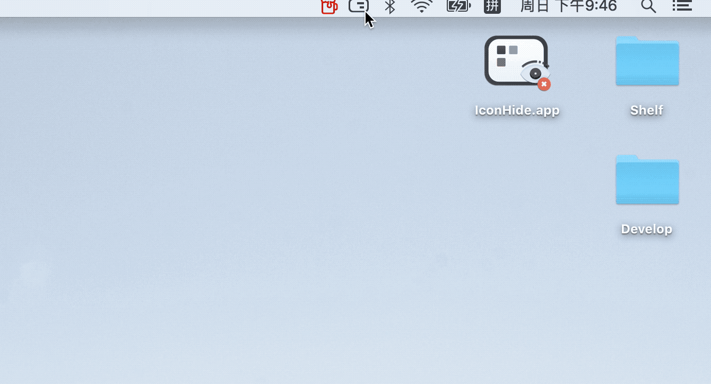

# IconHide-App
A Simple Application for Hiding Desktop Icons on Macos

## Preview

## Download

You can download it from Relases or [click](https://github.com/Zeqiang-Lai/IconHide-App/releases/latest) here.

## Acknowledgement

Part of App Icon (the eye) is made by <a href="https://www.flaticon.com/authors/pixelmeetup" title="Pixelmeetup">Pixelmeetup</a> from <a href="https://www.flaticon.com/" title="Flaticon">www.flaticon.com</a>, which is licensed by <a href="http://creativecommons.org/licenses/by/3.0/" title="Creative Commons BY 3.0" target="_blank">CC 3.0 BY.</a>

